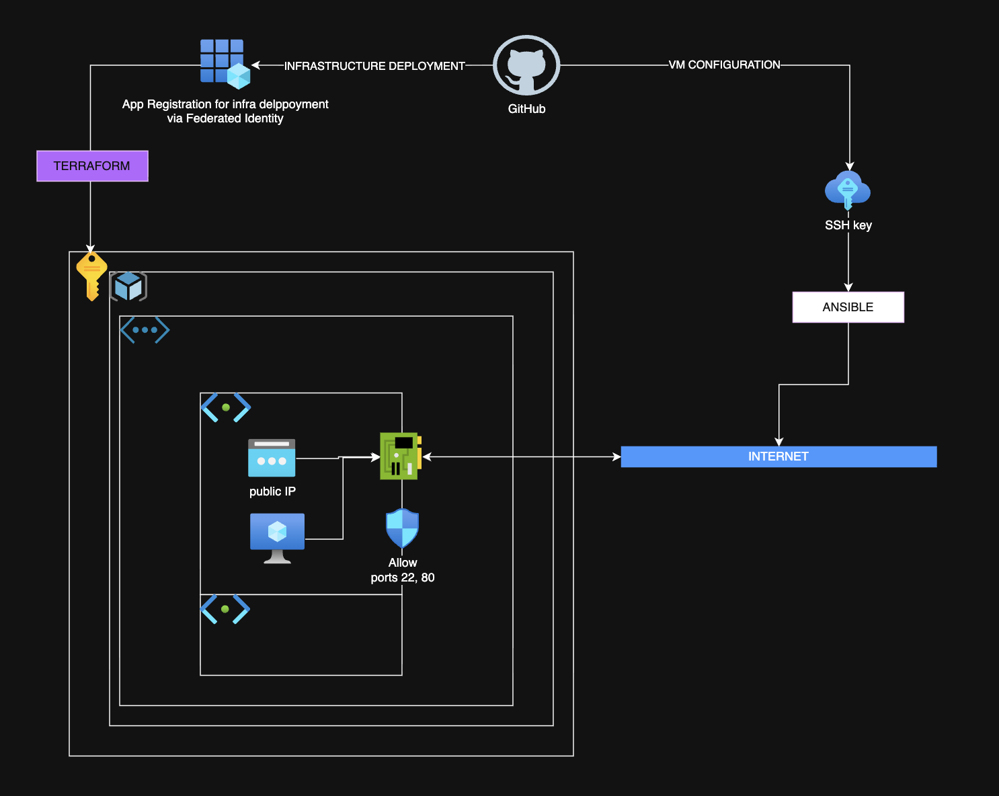
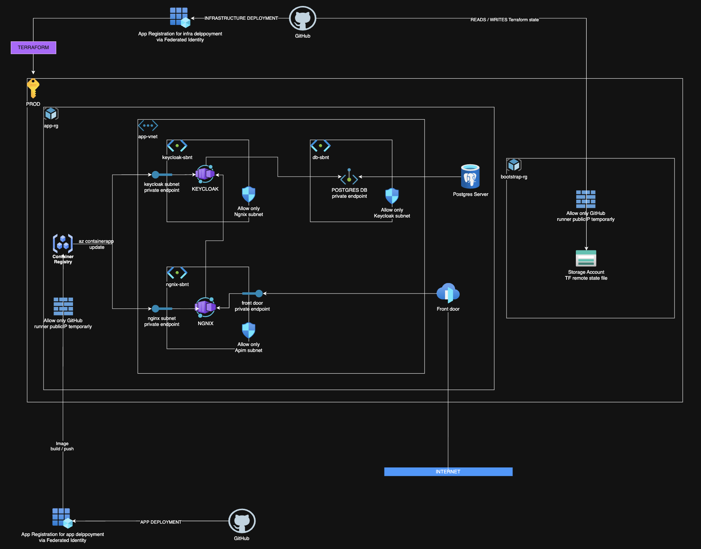

# Azure VM Container Environment with Keycloak Authentication

## 1. Project Overview
This project provisions an Azure VM with a minimal container environment using Terraform and Ansible. It deploys:
- **Keycloak** for authentication
- **PostgreSQL** as Keycloak’s database
- **Nginx** to serve a static web page and act as a reverse proxy to Keycloak
Access to the static page is controlled via Keycloak authentication.

## 2. Architecture

## 3. Infrastructure
- **Terraform Structure**:
  - `modules/` → core Azure resources
  - `support/` → common properties for all environments
  - `deployment/` → `common_infrastructure` (VNet, NSG, RG) and `services` (VM)
  - `varvalues/` → environment-specific variables
  - `backend/` → remote state configuration
- **Bootstrap Script**:
  - Creates App Registrations, federated identities, SSH key, GitHub secrets.
- **VM Specs**:
  - Size: `Standard_B1ms` (supports workload for Keycloak + Postgres + Nginx)
  - OS: Ubuntu 20.04 LTS (native Docker support, apt ecosystem)
- **Networking**:
  - NSG allows ports 22 (SSH) and 80 (HTTP)
- **Remote State**:
  - Stored in Azure Storage Account for secure access control
- **Logging**:
  - AMA Log Analytics for Docker logs

## 4. Configuration (Ansible)
Playbook: `deploy.yml`
- Copy `index.html.j2`
- Configure Nginx:
  - `/` → static page
  - `/keycloak` → reverse proxy to Keycloak
- Create Docker network
- Deploy containers in order:
  1. PostgreSQL
  2. Keycloak (after DB ready)
  3. Nginx
- Post-deployment:
  - Obtain Keycloak admin token
  - Create `nginx-client` in Keycloak
- Static page uses `const keycloak = new Keycloak()` for auth.

## 5. CI/CD (GitHub Actions)
### Pipelines:
- **Filter Pipeline** (`filter-pipeline.yml`):
  - Trigger: PR to `main`, push to `main`, manual
  - Uses matrix to detect changes and call exec pipeline
- **Exec Pipeline** (`exec-pipeline.yml`):
  - Steps:
    1. Check if pipeline should run (git diff)
    2. az login - via federated identity App Registration
    2. Add firewall rules for runner
    3. Terraform init, validate, security check, plan, apply
    4. Remove firewall rules for runner
    5. Run Ansible
- **Destroy Pipeline** (`destroy-pipeline.yml`):
  - Manual trigger
  - Runs `terraform destroy`

## 6. Justifications
- **Docker**: Lightweight, mature ecosystem
- **Ubuntu**: Native Docker support, apt ecosystem
- **Official Images**: Security and compatibility
- **NSG Config**: Minimal exposure (SSH, HTTP)

## 7. Possible Extensions
- HTTPS with Let’s Encrypt
- Azure Key Vault for secrets
- Monitoring (Prometheus/Grafana)
- Auto scale-out & scale up
- Disaster Recovery
- Use PaaS for Postgres
- Use app services/container services for keycloak/nginx
- Put Front Door in front of Nginx app
- Use Entra ID auth instead of keycloak

## 8. My desired Architecture (not perfect, but smth I'd like to work on)

For three containers (Keycloak, Postgres, Nginx), a full VM is often overkill, and AKS (Azure Kubernetes Service) is even more so because:
AKS Pros: Great for scaling, orchestration, rolling updates, and HA.
AKS Cons: Complex setup, higher cost, cluster management overhead.

### Azure Container Apps
- Fully Managed Environment
  - No need to manage VMs, OS updates, or Kubernetes clusters
  - Microsoft handles scaling, networking, and security patches
- Built-in Features
  - HTTPS by default (no manual SSL setup)
  - Autoscaling based on CPU, memory, or custom metrics
- Cost Efficiency
  - Pay only for what you use
  - No cluster overhead like AKS
  - Ideal for small workloads (3 containers) without paying for idle VM time
- Deployment Simplicity
  - Connect to Azure Container Registry (ACR)
- Scalability
  - Start small and scale to thousands if needed
  - No redesign required when your app grows

### Front door
- Front Door acts as a global entry point, allowing backend (NGINX) to remain in a private VNET without a public IP, connected securely via Private Link
- Users connect to the nearest Microsoft edge location, reducing latency and improving response times
- Built-in WAF and DDoS Protection
- SSL Termination and Custom Domains
- Automatically routes traffic to healthy backends, ensuring resilience and uptime

### PaaS Postgres
- Microsoft handles patching, backups, high availability, and scaling—no manual maintenance required
- Supports Private Endpoints, encryption at rest and in transit, and compliance with enterprise standards
- Automated Backups and Restore

### Deployment Flow
- Build Docker images → Push to ACR → Update Container App revision
- GitHub Actions can automate:
  - docker build + docker push
  - az containerapp update --image <tag>

### Possible perfect improvements for this approach
1. Identity -> Entra ID (old AAD - not sure why Azure did it) Keycloak
2. Reverse Proxy / Routing -> Front Door + App Gateway instead of NGINX
3. Static Content -> Azure Storage + CDN

## Honest conclusion
This project was a lot of fun, and I’m definitely going to keep working on it. You can follow my progress—it’ll stay open source.
The biggest challenge? Time, for sure. Two weeks would’ve been perfect, but with 11 projects at work, family stuff, and just moving in into new home… yeah, worst timing ever for a new project.
On top of that, this was my first time using GitHub (I’m usually on GitLab, Azure DevOps, and Jenkins—Jenkins is my champ).

Things I didn’t have time to debug:
- Ansible couldn’t connect to the VM via SSH using dawidd6/action-ansible-playbook@v5—works fine locally though (on github issues within remote repo, other people has simillar issue)
- Terraform structure might be a bit overkill for this project, same for the workflows
- Locally, index.html throws an error when running:
 const keycloak = new Keycloak({
      url: '/keycloak',          
      realm: 'master',
      clientId: 'nginx-client'
    });
- AMA logging for VM has some issues with tf deploying
- I normaly don't push things straightly to the main branch, but this is the test case, forgive me :)